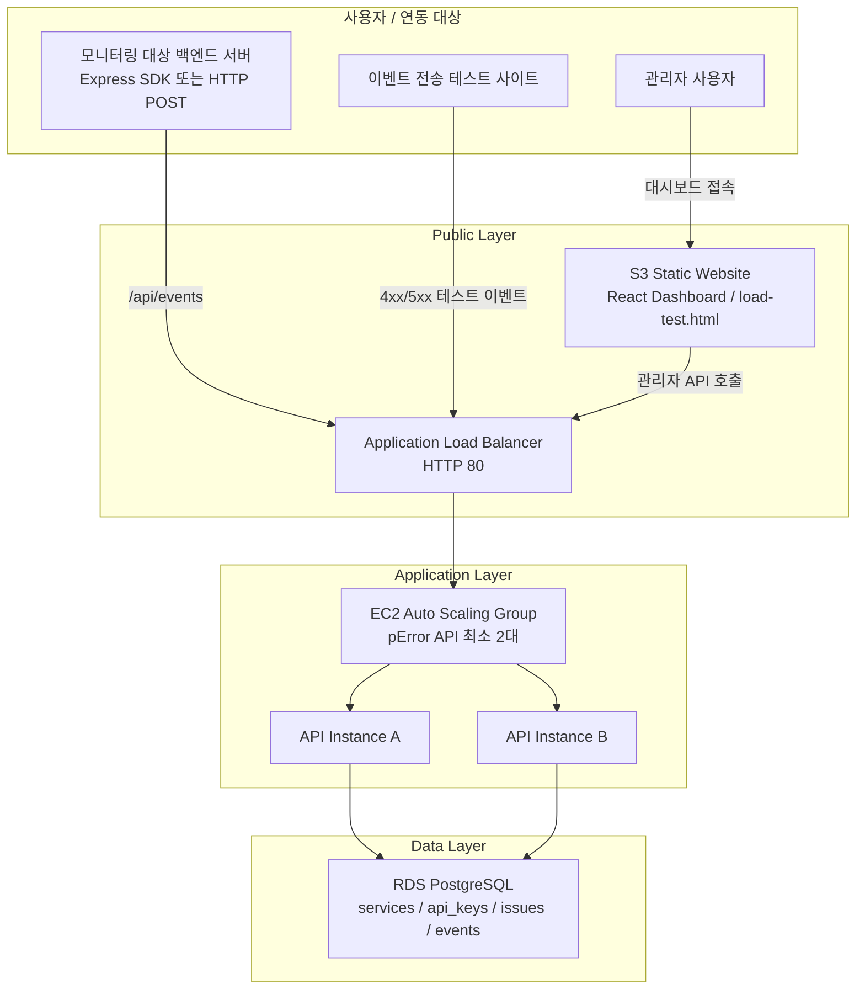
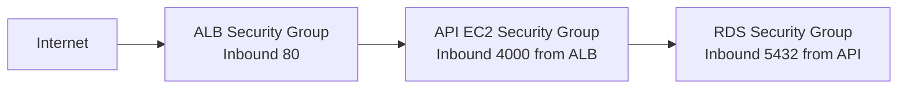

# AWS 아키텍처

## 개요

`pError`는 서버 에러 이벤트를 수집하는 API 서버가 장애나 트래픽 증가에도 계속 동작해야 하는 서비스입니다. 모니터링 시스템이 멈추면 실제 서비스 장애를 추적할 수 없기 때문에, 과제용 AWS 구조에서는 API 수집 계층을 고가용성으로 구성합니다.



S3는 정적 웹사이트 호스팅 계층입니다. 대시보드는 저장된 이슈를 조회하는 화면이고, 이벤트 전송 테스트 사이트는 시연용 이벤트를 발생시키는 테스트 화면입니다. 실제 에러 이벤트 수집과 저장은 ALB 뒤의 EC2 API 서버와 RDS가 담당합니다.

## 보안그룹 흐름



## 서비스별 역할

### ALB

`ALB`는 외부 요청을 여러 API 인스턴스로 분산합니다. `/health` 엔드포인트를 대상으로 헬스체크를 수행하고, 비정상 인스턴스에는 트래픽을 보내지 않습니다.

### EC2 Auto Scaling Group

API 서버는 EC2 Launch Template으로 생성되며 Auto Scaling Group이 최소 2대 이상을 유지합니다. CPU 사용률이 증가하면 Target Tracking 정책으로 인스턴스 수를 늘릴 수 있습니다.

### RDS PostgreSQL

RDS는 서비스 정보, API Key 해시, 그룹핑된 이슈, 개별 에러 이벤트를 저장합니다. API 서버만 RDS에 접근하도록 Security Group을 분리했습니다.

### S3

React 대시보드는 정적 파일로 빌드한 뒤 S3 정적 웹사이트 버킷에 올리는 구조입니다. API 주소는 빌드 시 `VITE_API_BASE_URL`로 지정하고, 이벤트 전송 테스트 사이트는 같은 버킷의 `/runtime-config.json`에서 배포 시점 ALB 주소를 읽습니다.

같은 S3 버킷에 `/load-test.html` 정적 페이지도 배포합니다. 이 페이지는 브라우저에서 ALB API로 `Health` 요청과 4xx/5xx 에러 이벤트 요청을 보내고, 응답 시간/성공률/p95를 즉시 보여주는 이벤트 전송 테스트 사이트입니다.

### Security Group

- ALB: 인터넷에서 80번 포트 허용
- API EC2: ALB에서 4000번 포트만 허용
- RDS: API EC2 Security Group에서 5432번 포트만 허용

## 고가용성 시나리오

1. 사용자가 에러 이벤트를 전송한다.
2. ALB가 정상 API 인스턴스로 요청을 분산한다.
3. 특정 EC2 인스턴스가 장애 상태가 되면 ALB 헬스체크에서 제외된다.
4. Auto Scaling Group이 원하는 인스턴스 수를 복구한다.
5. RDS에 저장된 이슈/이벤트 데이터는 새 인스턴스에서도 동일하게 조회된다.

## 이벤트 전송 테스트 시연

1. S3 대시보드의 `/load-test.html`에 접속한다.
2. ALB API 주소와 관리자 비밀번호를 입력해 테스트용 서비스를 생성한다.
3. 요청 수와 동시 요청 수를 선택하고 실행한다.
4. 패널에서 성공률, 평균 응답 시간, p95를 확인한다.
5. pError 대시보드에서 `html-load-test` 이벤트와 이슈가 증가한 것을 확인한다.

## 비용 방지

이 저장소의 Terraform 코드는 제출용 구조 검증을 목적으로 합니다. 기본 작업에서는 `terraform apply`를 실행하지 않습니다. 실제 배포 후에는 반드시 다음 명령으로 리소스를 제거해야 합니다.

```bash
terraform destroy
```
