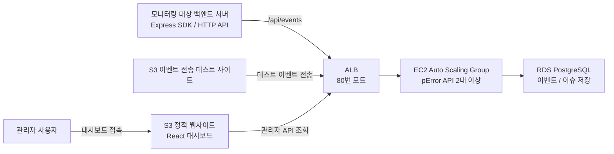

# AWS 클라우드 컴퓨팅 기말 프로젝트 제출 문서

## 1. 제출 정보

- 프로젝트명: `pError`
- 주제: AWS 기반 고가용성 개인 서버 에러 모니터링 웹 서비스
- GitHub 저장소: https://github.com/thswldns77/pError
- 제출 범위: 소스 코드, Terraform IaC, 실행 문서, 테스트 문서

`pError`는 Sentry와 유사한 개인용 서버 에러 모니터링 서비스입니다. Express 같은 백엔드 서버에서 발생한 500 계열 에러를 수집하고, 같은 원인의 에러를 이슈 단위로 그룹화해 대시보드에서 확인할 수 있도록 만들었습니다.

AWS Academy 실습 리소스는 비용 방지를 위해 검증 후 삭제할 수 있도록 Terraform으로 재생성 가능한 구조로 작성했습니다. 실제 접속 주소는 재배포 시 `terraform output` 또는 `scripts/deploy-dashboard.sh` 출력에서 확인합니다.

## 2. 프로젝트 선정 이유

이번 과제는 S3, EC2, AWS CLI, Terraform, ALB, ASG, RDS, 모니터링, 부하 테스트 등 수업에서 다룬 클라우드 컴퓨팅 개념을 종합해 작은 AWS 기반 웹 서비스를 만드는 것이 목표입니다.

저는 WordPress 확장 대신 새로운 웹 서비스인 `pError`를 구현했습니다. 서버 에러 모니터링은 실제 개인 프로젝트나 백엔드 서비스 운영에서 바로 사용할 수 있는 주제이며, 에러 수집 API가 장애 상황에서도 계속 동작해야 하므로 ALB와 Auto Scaling Group을 이용한 고가용성 구성을 설명하기에 적합하다고 판단했습니다.

## 3. 주요 기능

- 서버 에러 이벤트 수집 및 RDS 저장
- Service API Key 기반 이벤트 인증
- 같은 원인의 에러를 이슈로 그룹화
- React 관리자 대시보드를 통한 이슈/이벤트 조회
- Express SDK 및 공통 HTTP API 연동 지원
- S3 이벤트 전송 테스트 사이트와 k6 부하 테스트
- Terraform 기반 AWS 고가용성 인프라 구성

## 4. 과제 요구사항 대응

| 과제 요소 | pError에서의 구현 |
| --- | --- |
| AWS 기반 웹 서비스 | 개인 서버 에러 모니터링 API와 대시보드 구현 |
| S3 | React 대시보드와 HTML 이벤트 전송 테스트 사이트 정적 호스팅 |
| EC2 | pError API 서버 실행 |
| Terraform IaC | `infra/terraform`에서 ALB, EC2 ASG, RDS, S3 등을 코드로 정의 |
| ALB | 외부 요청을 API 서버 인스턴스로 분산 |
| ASG | API 서버를 Auto Scaling Group으로 구성해 최소 인스턴스 수 유지 |
| 고가용성 | ALB Health Check와 ASG 복구를 통해 단일 EC2 장애에 대응 |
| RDS | PostgreSQL에 서비스, API Key, 이슈, 이벤트 저장 |
| 모니터링 | 대시보드에서 열린 이슈, 누적 이벤트, 서비스별 수집 현황 확인 |
| 벤치마킹/부하 테스트 | k6로 이벤트 요청 부하를 생성하고, S3 이벤트 전송 테스트 사이트로 수집 흐름 시연 |
| 문서화 | README, AWS 아키텍처 문서, 테스트 리포트 작성 |

## 5. AWS 아키텍처



S3 정적 웹사이트는 에러를 수집하는 서버가 아니라, 수집 결과를 확인하는 대시보드와 이벤트 전송 테스트 사이트 역할을 합니다. 실제 수집은 ALB 뒤의 EC2 pError API 서버가 담당합니다.

### 사용한 AWS 서비스

- `S3`: React 대시보드와 이벤트 전송 테스트 HTML 페이지 배포
- `EC2`: pError API 서버 실행
- `ALB`: API 서버 앞단의 로드 밸런서
- `Auto Scaling Group`: API 서버 인스턴스 수 유지 및 자동 확장
- `RDS PostgreSQL`: 에러 이벤트와 이슈 데이터 저장
- `Security Group`: ALB, API, DB 계층별 접근 제어
- `IAM`: AWS Academy에서 제공하는 실습용 Instance Profile 사용

## 6. 저장소 구조

```text
apps/api             pError 수집 API와 관리자 API
apps/dashboard       React 기반 관리자 대시보드
apps/sample-server   pError SDK가 적용된 샘플 Express 서버
packages/sdk-express Express 서버용 pError SDK
infra/terraform      AWS 인프라 구성을 위한 Terraform 코드
tests/load           k6 부하 테스트 스크립트
docs                 제출 문서, 아키텍처 문서, 테스트 리포트
```

## 7. AWS 배포 방법

AWS Academy 환경에서 다음 순서로 배포합니다.

### 7.1 Terraform 변수 준비

```bash
cp infra/terraform/terraform.tfvars.example infra/terraform/terraform.tfvars
```

`infra/terraform/terraform.tfvars`에서 아래 값을 설정합니다.

```hcl
aws_region      = "us-east-1"
github_repo_url = "https://github.com/<github-id>/pError.git"
admin_password  = "<dashboard-admin-password>"
auth_secret     = "<long-random-secret>"
```

AWS Academy에서는 EC2 인스턴스 프로파일을 새로 만들 권한이 제한될 수 있으므로, Terraform은 기본값으로 `LabInstanceProfile`을 사용합니다.

### 7.2 인프라 생성

```bash
cd infra/terraform

terraform init
terraform fmt -check -recursive
terraform validate
terraform plan -out=tfplan
terraform apply "tfplan"
```

배포 후 ALB, S3, RDS 주소를 확인합니다.

```bash
terraform output
```

### 7.3 대시보드 S3 업로드

React 대시보드는 ALB 주소를 API Base URL로 넣어 빌드한 뒤 S3에 업로드합니다. 재배포할 때는 아래 스크립트가 현재 ALB DNS를 찾아 대시보드를 빌드하고, `/runtime-config.json`까지 갱신한 뒤 S3에 동기화합니다.

```bash
cd ../..
scripts/deploy-dashboard.sh
```

### 7.4 배포 확인과 삭제

```bash
cd infra/terraform

ALB_URL="$(terraform output -raw alb_dns_name)"
curl -i "http://$ALB_URL/health"
```

제출 또는 시연이 끝난 뒤에는 비용 방지를 위해 리소스를 삭제합니다.

```bash
terraform destroy
```

## 8. 테스트 방법

### API Health Check

```bash
curl -i "$ALB_URL/health"
```

### 에러 이벤트 수집 테스트

S3 이벤트 전송 테스트 사이트에서 관리자 비밀번호로 테스트 서비스를 생성한 뒤 4xx/5xx 이벤트를 전송합니다. 운영 서버에 붙일 때는 대시보드에서 발급한 Service API Key를 SDK 또는 `/api/events` HTTP 요청에 사용합니다.

### k6 부하 테스트

```bash
BASE_URL=http://<alb-dns-name> PERROR_API_KEY=perror_xxxxx k6 run tests/load/events.js
```

### S3 이벤트 전송 테스트

S3에 배포된 `/load-test.html`을 열면 `/runtime-config.json`에 기록된 ALB 주소가 자동으로 입력됩니다. 이후 다음 순서로 테스트합니다.

```text
관리자 비밀번호 입력
-> Health 확인
-> 테스트 서비스 생성
-> 요청 수와 동시 요청 수 선택
-> 실행
-> 대시보드에서 이벤트와 이슈 증가 확인
```

## 9. 이슈 그룹화 방식

`pError`는 모든 이벤트를 각각 저장하지만, 대시보드에서는 비슷한 에러를 이슈로 묶어 보여줍니다. 그룹화 기준은 다음과 같습니다.

```text
서비스 ID + 에러 메시지 + stack 첫 줄 + 요청 path
```

예를 들어 부하 테스트에서 30개의 에러 이벤트를 보내더라도 `/api/orders`, `/api/payments`, `/jobs/nightly-sync`처럼 path가 3개로 나뉘면 이슈는 3개 그룹으로 표시될 수 있습니다. 따라서 이벤트 수는 실제 발생 횟수이고, 이슈 수는 같은 원인의 에러를 묶은 그룹 수입니다.

## 10. 검증 결과

다음 항목을 검증했습니다. 자세한 내용은 `docs/test-report.md`에 정리했습니다.

- TypeScript typecheck 통과
- Unit test 통과
- Build 통과
- Terraform fmt 통과
- Terraform validate 통과
- API Health Check 통과
- 테스트 이벤트 수집 통과
- 이슈 그룹화 동작 확인
- k6 부하 테스트 통과
- AWS Academy 환경에서 ALB, EC2 ASG, RDS, S3 배포 확인
- S3 HTML 이벤트 전송 테스트 사이트를 통한 이벤트 수집 확인

## 11. 직접 구현한 부분

- pError API 서버
- 관리자 로그인 및 토큰 기반 인증
- 서비스 생성과 API Key 발급
- 에러 이벤트 수집 API
- 공통 HTTP 이벤트 수집 규격
- 이슈 fingerprint 생성 및 그룹화 로직
- React 대시보드
- Express SDK
- 용도별 SDK/HTTP 연동 안내 화면
- 샘플 Express 서버
- k6 부하 테스트 스크립트
- S3 HTML 이벤트 전송 테스트 사이트
- Terraform 인프라 코드
- 한국어 README와 제출 문서

## 12. AI 도구 및 오픈소스 사용

AI 도구는 설계 검토, 코드 작성 보조, 문서 작성 보조, 디버깅 보조 용도로 사용했습니다. 프로젝트의 주제 선정, AWS 구성, 구현 범위, 테스트 흐름은 과제 요구사항에 맞춰 직접 정리했습니다. 타인의 프로젝트를 그대로 가져와 제 작업물처럼 제출하지 않았습니다.

사용한 주요 오픈소스 도구는 다음과 같습니다.

- Express
- React
- Vite
- Prisma
- PostgreSQL
- Terraform
- k6

## 13. 비용 관리

AWS Academy 환경에서도 EC2, ALB, RDS를 장시간 켜두면 크레딧이 소모될 수 있습니다. 따라서 테스트 또는 검토 후에는 다음 명령으로 리소스를 삭제합니다.

```bash
cd infra/terraform
terraform destroy
```

## 14. 제출 요약

본 프로젝트는 AWS 클라우드 컴퓨팅 수업에서 다룬 S3, EC2, Terraform, ALB, ASG, RDS, 부하 테스트, 모니터링 개념을 종합해 구현한 개인 서버 에러 모니터링 웹 서비스입니다. GitHub 저장소에는 소스 코드, Terraform 코드, AWS 배포 방법, 테스트 리포트가 포함되어 있습니다.
